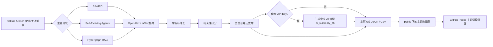

# 功能逻辑拆解

## 目标

把 BIM/IFC、自进化 Agent、超图 RAG 三个平行主题做成低维护的每日情报流：每天自动搜索、按主题筛选、独立去重保存，必要时生成中文 AI 摘要，并在同一个网页中切换浏览。

## 数据流

## 模块说明

| 模块 | 文件 | 职责 |
| --- | --- | --- |
| 主题注册 | `src/paper_radar/topics/__init__.py` | 注册三个主题并提供 CLI slug 查找 |
| BIM/IFC | `src/paper_radar/topics/bim_ifc.py` | BIM/IFC 查询词、权重和上下文规则 |
| 自进化 Agent | `src/paper_radar/topics/self_evolving_agent.py` | 自进化 Agent 查询词和共现规则 |
| 超图 RAG | `src/paper_radar/topics/hypergraph_rag.py` | Hypergraph + RAG 查询词和共现规则 |
| 通用配置 | `src/paper_radar/config.py`、`topics/base.py` | 默认请求参数、主题数据结构 |
| 采集入口 | `src/paper_radar/collect.py` | CLI、调度 OpenAlex/arXiv、读写数据、触发中文摘要 |
| 匹配逻辑 | `src/paper_radar/matching.py` | 标题/摘要归一化、相关性打分、命中词提取 |
| 去重逻辑 | `src/paper_radar/storage.py` | 读取历史数据、生成多键索引、合并记录、输出 JSON/CSV |
| 中文 AI 摘要 | `src/paper_radar/summarize.py` | 使用 DeepSeek 或 OpenAI API，按当前主题语境生成 `ai_summary_zh` |
| 页面 | `public/index.html` | 切换主题数据集，展示摘要、搜索、来源筛选和列表 |
| 自动化 | `.github/workflows/daily-papers.yml` | 定时采集、提交数据、部署 GitHub Pages |

## 相关性规则

每个主题的明确短语会直接加高分，例如：

- `building information modeling`
- `building information modelling`
- `industry foundation classes`
- `openbim`
- `ifc schema`
- `scan-to-bim`
- `self-evolving agent`
- `agent self-evolution`
- `hypergraph RAG`
- `hypergraph retrieval-augmented generation`

缩写需要上下文保护：

- `BIM` 需要和 `construction`、`building`、`AEC`、`facility management`、`digital twin` 等上下文共同出现。
- `IFC` 需要和 `BIM`、`openBIM`、`schema`、`Industry Foundation Classes`、建筑/施工语境共同出现。

这样可以减少 `IFC` 被误判为金融、医学或其他缩写的情况，也能避免 `BIM` 作为人名、基因名或非建筑语境时误入库。

两个新主题也使用共现保护：

- 自进化 Agent 要求“self-evolution / self-improvement”等概念与 Agent、LLM 或 agentic 上下文共现。
- 超图 RAG 要求“hypergraph”与“RAG / retrieval-augmented generation”同时出现，避免收录普通超图论文或普通 RAG 论文。

## 中文 AI 摘要规则

如果配置了 `DEEPSEEK_API_KEY` 或 `OPENAI_API_KEY`，采集器会对缺失 `ai_summary_zh` 的论文调用相应 API：

- 输出语言固定为简体中文。
- 摘要长度控制在 80-140 个汉字，1-2 句话。
- 内容聚焦研究对象、方法或贡献。
- 每个主题默认最多补 20 篇，可用 `AI_SUMMARY_LIMIT` 调整。
- 已经有 `ai_summary_zh` 的论文不会重复生成，除非手动加 `--refresh-summaries`。

如果没有配置任一 API Key，项目仍会正常采集、去重和部署，只是不生成新的中文摘要。

## 为什么使用滚动窗口

论文数据库通常不是实时入库。同一篇论文可能在发表后一段时间才被 OpenAlex 或 arXiv 搜到，所以每日任务不是只查当天，而是回看最近 30 天，并把发布日期上限限制为当前日期，然后通过 DOI/URL/标题等多键索引去重合并。这样更稳，也不会重复展示同一篇论文。

## 部署逻辑

GitHub Actions 完成五件事：

1. 安装 Python 依赖。
2. 运行 `python -m paper_radar.collect --all-topics --days 30 --max-per-source 80`。
3. 如果配置了模型 API Key，为各主题缺失摘要的论文生成中文 AI 摘要。
4. 如果 `data/` 或 `public/` 有变化，就自动提交回仓库。
5. 把 `public/` 上传为 GitHub Pages artifact 并部署。

## 可扩展方向

- 增加 Semantic Scholar、Crossref、CORE 等来源。
- 增加摘要质量检查，例如把“无法判断”的论文标记出来。
- 增加关键词订阅，例如 `digital twin + BIM`、`scan-to-BIM`、`automated code compliance`。
- 增加邮件、飞书、企业微信或 GitHub Issue 每日摘要推送。
