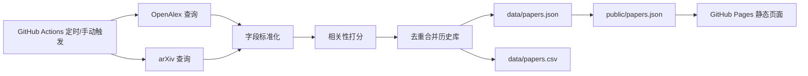

# 功能逻辑拆解

## 目标

把 BIM、IFC、openBIM、Industry Foundation Classes 相关论文做成一个低维护的每日情报流：每天自动搜索、筛选、去重、保存，并发布成网页。

## 数据流

## 模块说明

| 模块 | 文件 | 职责 |
| --- | --- | --- |
| 配置 | `src/paper_radar/config.py` | 维护检索词、权重、上下文词、默认请求参数 |
| 采集入口 | `src/paper_radar/collect.py` | CLI、调度 OpenAlex/arXiv、读写数据 |
| 匹配逻辑 | `src/paper_radar/matching.py` | 标题/摘要归一化、相关性打分、命中词提取 |
| 去重逻辑 | `src/paper_radar/storage.py` | 读取历史数据、生成指纹、合并记录、输出 JSON/CSV |
| 页面 | `public/index.html` | 读取 `papers.json`，提供搜索、来源筛选和列表展示 |
| 自动化 | `.github/workflows/daily-papers.yml` | 定时采集、提交数据、部署 GitHub Pages |

## 相关性规则

明确短语直接加高分，例如：

- `building information modeling`
- `building information modelling`
- `industry foundation classes`
- `openbim`
- `ifc schema`
- `scan-to-bim`

缩写需要上下文保护：

- `BIM` 需要和 `construction`、`building`、`AEC`、`facility management`、`digital twin` 等上下文共同出现。
- `IFC` 需要和 `BIM`、`openBIM`、`schema`、`Industry Foundation Classes`、建筑/施工语境共同出现。

这样可以减少 `IFC` 被误判为金融、医学或其他缩写的情况，也能避免 `BIM` 作为人名、基因名或非建筑语境时误入库。

## 为什么使用滚动窗口

论文数据库通常不是实时入库。同一篇论文可能在发表后一段时间才被 OpenAlex 或 arXiv 搜到，所以每日任务不是只查当天，而是回看最近 30 天，并把发布日期上限限制为当前日期，然后通过 DOI/URL/标题去重合并。这样更稳，也不会重复展示同一篇论文。

## 部署逻辑

GitHub Actions 完成四件事：

1. 安装 Python 依赖。
2. 运行 `python -m paper_radar.collect --days 30 --max-per-source 80`。
3. 如果 `data/` 或 `public/` 有变化，就自动提交回仓库。
4. 把 `public/` 上传为 GitHub Pages artifact 并部署。

## 可扩展方向

- 增加 Semantic Scholar、Crossref、CORE 等来源。
- 给论文加 LLM 摘要或中文导读。
- 增加关键词订阅，例如 `digital twin + BIM`、`scan-to-BIM`、`automated code compliance`。
- 增加邮件、飞书、企业微信或 GitHub Issue 每日摘要推送。
